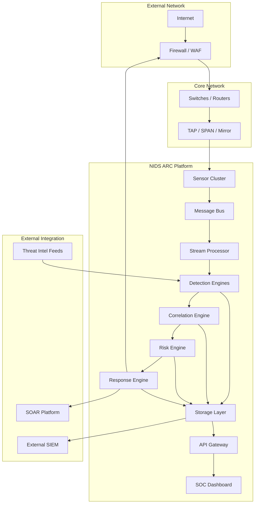
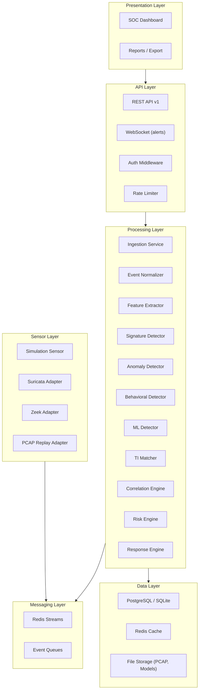
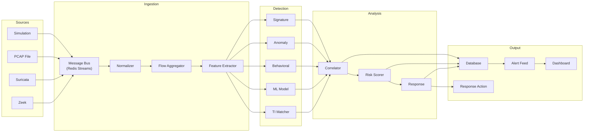
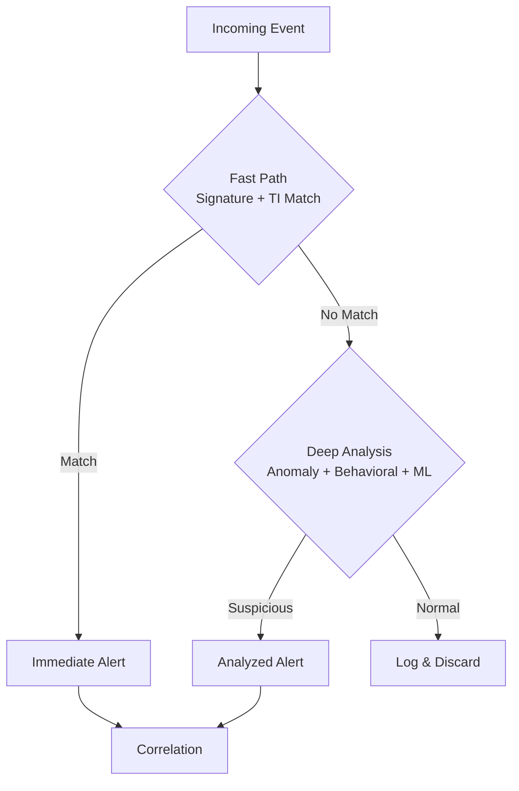
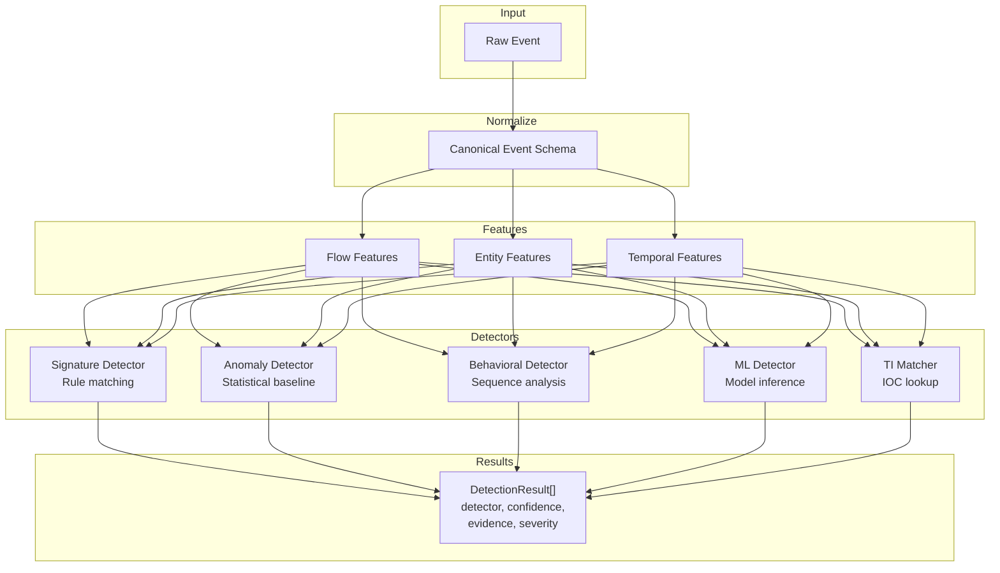
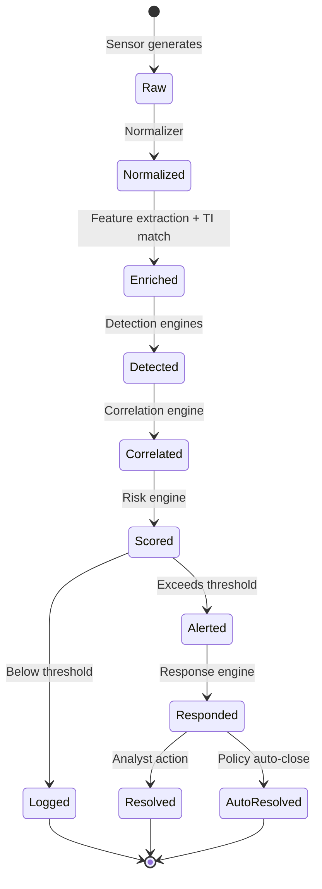
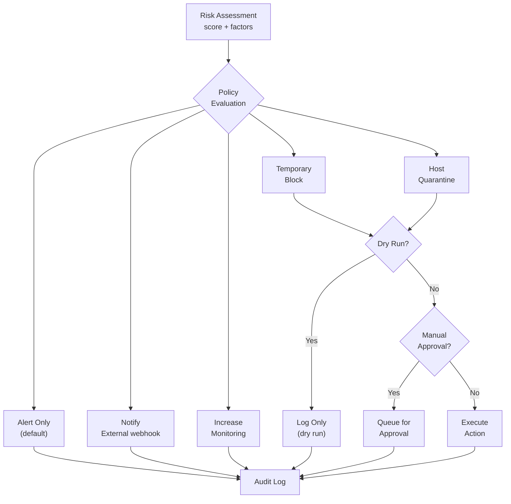
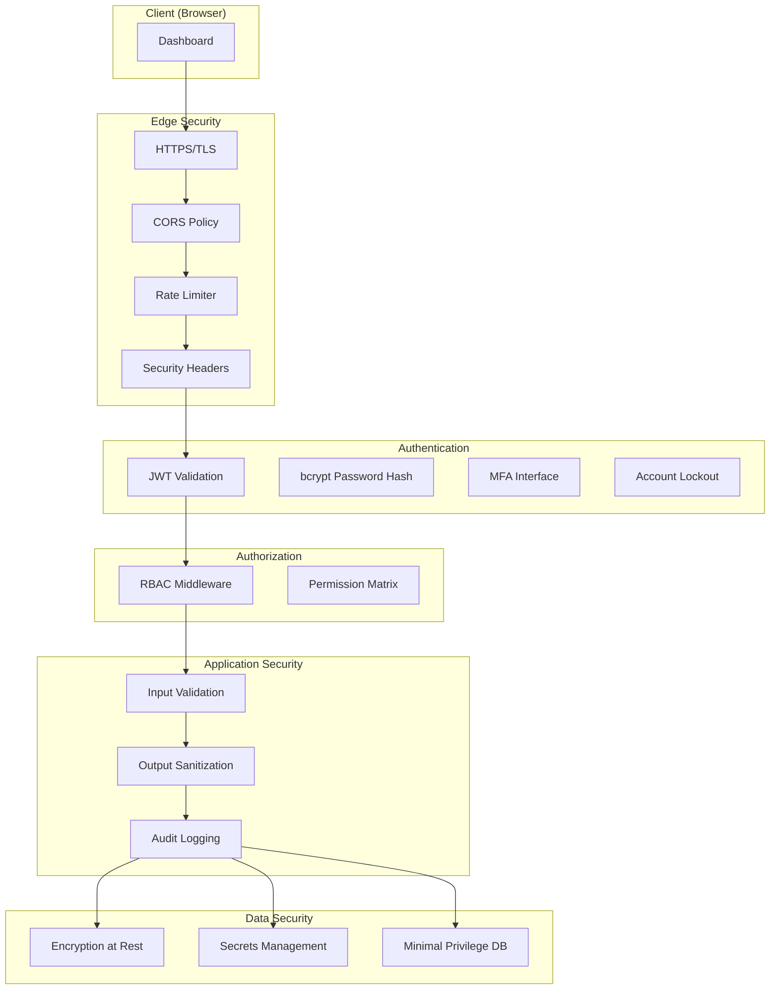
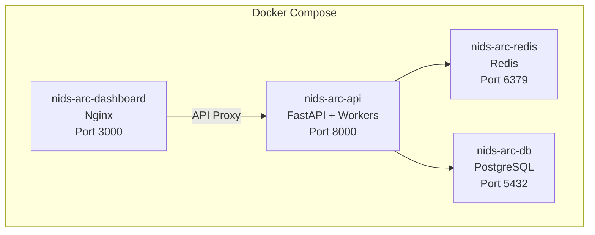
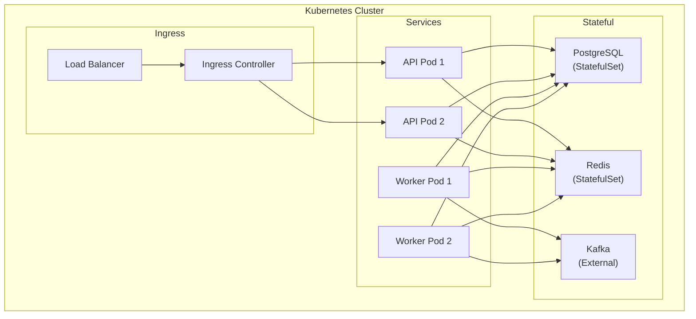

# NIDS ARC — System Architecture

## 1. System Context

NIDS ARC operates as a security monitoring layer that sits alongside network infrastructure, receiving copies of network traffic (via TAP/SPAN/mirror ports or sensor agents), analyzing it through multiple detection engines, correlating findings, assessing risk, and optionally executing policy-controlled response actions.



---

## 2. Logical Architecture

The platform is organized into six architectural layers:



---

## 3. Component Architecture

### 3.1 Sensor Layer
| Component | Responsibility | Implementation |
|---|---|---|
| `SensorAdapter` (interface) | Abstract interface for all sensor types | Python ABC |
| `SimulationSensor` | Generates synthetic network events | Built-in |
| `SuricataAdapter` | Reads Suricata EVE JSON output | Adapter (interface + stub) |
| `ZeekAdapter` | Reads Zeek log output | Adapter (interface + stub) |
| `PcapReplayAdapter` | Reads PCAP files and replays as events | Built-in |
| `SensorManager` | Manages sensor lifecycle, health tracking | Built-in |

### 3.2 Ingestion & Processing
| Component | Responsibility |
|---|---|
| `IngestionService` | Receives raw events from message bus, validates, normalizes |
| `EventNormalizer` | Converts sensor-specific formats to canonical schema |
| `FlowAggregator` | Aggregates packets into flows (5-tuple + time) |
| `FeatureExtractor` | Computes flow-level and entity-level features for detection |
| `MessageBus` (interface) | Abstract message bus — Redis Streams (dev), Kafka (prod) |

### 3.3 Detection Layer
| Component | Responsibility |
|---|---|
| `Detector` (interface) | Base interface for all detectors |
| `SignatureDetector` | Rule-based pattern matching |
| `AnomalyDetector` | Statistical baseline and deviation analysis |
| `BehavioralDetector` | Sequence and contextual pattern analysis |
| `MLDetector` | Machine learning model inference |
| `ThreatIntelMatcher` | IOC matching against threat intelligence database |
| `DetectionOrchestrator` | Routes events to appropriate detectors, collects results |

### 3.4 Analysis Layer
| Component | Responsibility |
|---|---|
| `CorrelationEngine` | Groups related detections into incidents |
| `RiskEngine` | Calculates contextual risk scores with explanation |
| `ResponseEngine` | Evaluates policies and executes/queues response actions |

### 3.5 Storage Layer
| Component | Responsibility |
|---|---|
| `EventRepository` | CRUD for security events |
| `AlertRepository` | CRUD for alerts with lifecycle management |
| `IncidentRepository` | CRUD for correlated incidents |
| `RuleRepository` | CRUD for detection rules |
| `ModelRepository` | CRUD for ML model metadata |
| `AuditRepository` | Append-only audit log storage |
| `ThreatIntelRepository` | CRUD for IOC records |
| `UserRepository` | CRUD for users and roles |

### 3.6 API Layer
| Component | Responsibility |
|---|---|
| `FastAPI Application` | HTTP server, routing, middleware |
| `AuthMiddleware` | JWT validation, user context injection |
| `RBACMiddleware` | Permission checking per endpoint |
| `RateLimiter` | Request rate enforcement |
| `ErrorHandler` | Consistent error response formatting |

### 3.7 Presentation Layer
| Component | Responsibility |
|---|---|
| `SOC Dashboard` | Multi-page web UI served as static files |
| `WebSocket Handler` | Real-time alert push to dashboard |

---

## 4. Data Flow



### Fast Path vs. Deep Analysis Path



---

## 5. Control Flow

### Request Processing
```
Client Request
  → Rate Limiter
    → Auth Middleware (JWT validation)
      → RBAC Middleware (permission check)
        → Input Validation (Pydantic)
          → Service Layer (business logic)
            → Repository Layer (data access)
              → Database
            ← Response
          ← Validation
        ← Authorization
      ← Authentication
    ← Rate Limit
  ← HTTP Response
```

### Detection Processing
```
Raw Event (from bus)
  → Event Normalizer
    → Flow Aggregator (if packet-level)
      → Feature Extractor
        → Detection Orchestrator
          → [Signature, Anomaly, Behavioral, ML, TI] (parallel)
        ← Detection Results []
      → Correlation Engine
        → Risk Engine
          → Response Engine
            → Policy Evaluation
              → Action Execution / Queue
```

---

## 6. Detection Pipeline



---

## 7. Event Pipeline (Event Lifecycle)



---

## 8. Response Pipeline



---

## 9. Storage Architecture

### Database Strategy
| Data Category | Storage | Rationale |
|---|---|---|
| Users, Roles, Config | SQLite/PostgreSQL (relational) | Structured, low-volume, relational |
| Security Events | SQLite/PostgreSQL (partitioned) | Time-series queries, retention |
| Alerts & Incidents | SQLite/PostgreSQL (relational) | Lifecycle tracking, queries |
| Detection Rules | SQLite/PostgreSQL + file system | Versioned, audited |
| ML Models | File system + metadata in DB | Binary artifacts |
| Threat Intel (IOCs) | SQLite/PostgreSQL | Lookup queries |
| Audit Logs | SQLite/PostgreSQL (append-only) | Compliance, immutable |
| Cache / Sessions | Redis | Fast access, TTL-based |
| PCAP Evidence | File system | Large binary files |
| Feature Store | Redis + DB | Fast read, persistence |

### Indexing Strategy
- Events: indexed on `timestamp`, `src_ip`, `dst_ip`, `severity`, `event_type`, `sensor_id`
- Alerts: indexed on `timestamp`, `severity`, `status`, `assigned_to`
- IOCs: indexed on `indicator_type`, `value`, `active`
- Audit: indexed on `timestamp`, `actor_id`, `action`

### Data Retention
- Events: configurable retention (default 90 days)
- Alerts: retained until explicitly archived
- Audit logs: retained for compliance period (default 1 year)
- ML models: retained indefinitely (metadata), binary artifacts per policy
- PCAP evidence: configurable (default 30 days)

---

## 10. Security Architecture



### Zero-Trust Principles
1. **Verify explicitly**: Every API request authenticated and authorized
2. **Least privilege**: Minimal permissions per role
3. **Assume breach**: Audit everything, limit blast radius
4. **Secure defaults**: Conservative configuration out of the box
5. **Defense in depth**: Multiple security layers

---

## 11. Deployment Architecture

### Development (Docker Compose)


### Production (Kubernetes-Ready)


---

## 12. Scaling Strategy

### Horizontal Scaling Points
| Component | Scaling Method | State |
|---|---|---|
| API Servers | Add replicas behind load balancer | Stateless |
| Detection Workers | Add worker processes/pods | Stateless |
| Ingestion Workers | Add consumers per partition | Stateless |
| Sensors | Add sensor instances | Stateless |
| Message Bus | Partition topics | Stateful (managed) |
| Database | Read replicas, partitioning | Stateful |
| Cache | Redis Cluster | Stateful (managed) |

### Partitioning Strategy
- Message bus: partition by `sensor_id` or `src_ip` hash for locality
- Events table: partition by timestamp (monthly)
- Detection: parallelize across workers, each consuming from partition

### Back-Pressure
- Message bus consumer lag monitoring
- Configurable batch sizes
- Overflow to disk when memory pressure detected
- Health endpoint reports back-pressure state

---

## 13. High Availability Strategy

### Component Redundancy
- API: 2+ replicas behind load balancer
- Workers: 2+ consumers per partition
- Database: Primary + replica (production)
- Redis: Sentinel or Cluster mode (production)
- Message Bus: Kafka with replication factor 3 (production)

### Failure Detection
- Health check endpoints polled by orchestrator
- Sensor heartbeat monitoring (last_seen tracking)
- Message bus consumer group rebalancing on worker failure
- Database connection pool with automatic reconnection

---

## 14. Failure Scenarios

| Scenario | Impact | Recovery |
|---|---|---|
| Sensor disconnects | No new events from that sensor | Alert on missing heartbeat, continue processing other sensors |
| Message bus unavailable | Event ingestion paused | Buffer locally, reconnect with backoff, replay buffered events |
| Database unavailable | No persistence, API degraded | Return 503, queue events in message bus, reconnect |
| ML model service crash | ML detection unavailable | Skip ML detection, continue with other engines, alert on health |
| TI service fails | No TI enrichment | Continue without TI, flag events as "TI unavailable" |
| Detection worker crash | Reduced throughput | Consumer group rebalances, other workers pick up partitions |
| Frontend unavailable | No dashboard | API still processes events, alerts still generated |
| Network connectivity lost | System isolated | Buffer events, retry connections, alert operators |

---

## 15. Recovery Strategy

### Automatic Recovery
1. **Reconnection**: All external connections (DB, Redis, Kafka) use exponential backoff retry
2. **Consumer rebalance**: Message bus consumer groups auto-rebalance on worker failure
3. **Circuit breaker**: External service calls use circuit breaker (open after 5 failures, half-open after 30s)
4. **Health-based restart**: Container orchestrator restarts unhealthy containers

### Manual Recovery
1. **Database restore**: Point-in-time recovery from backups
2. **Message replay**: Replay events from persistent message bus
3. **Model rollback**: Revert to previous model version via API
4. **Rule rollback**: Revert to previous ruleset version
5. **Configuration restore**: Restore from version-controlled config files

### Data Durability
- Events persisted to database after detection
- Message bus configured for persistence (Redis AOF, Kafka replication)
- Audit logs append-only with no delete API
- Model artifacts stored on persistent filesystem
