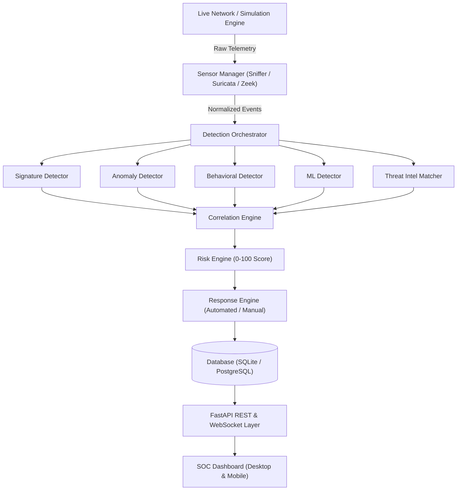

# ⚡ NIDS ARC

> **Autonomous Scalable Hybrid Network Intrusion Detection & Response Platform**

[](https://www.python.org/downloads/)
[](https://fastapi.tiangolo.com)
[](https://www.docker.com/)
[](LICENSE)

NIDS ARC is an enterprise-grade Network Intrusion Detection and Autonomous Response platform. It combines rule-based signature detection, statistical anomaly baselines, behavioral sequence analysis, and machine learning models into a unified security operations center (SOC) dashboard.

---

## 🌟 Key Features

- **🛡️ Hybrid Multi-Engine Detection:**
  - **Signature Engine:** Fast pattern matching for known attack signatures and CVEs.
  - **Anomaly Engine:** Continuous statistical baseline learning for deviation detection.
  - **Behavioral Engine:** Sliding-window sequence analysis for multi-stage attacks (e.g., port scan followed by brute force).
  - **Machine Learning Engine:** Scikit-learn isolation models for zero-day anomaly detection.
- **🎯 Contextual Risk & Correlation Engine:**
  - Automated MITRE ATT&CK technique mapping.
  - Multi-factor risk scoring (0–100) with explainable contribution factors.
  - Multi-event incident correlation.
- **🌐 Real-Time Threat Intelligence (TI):**
  - Integrated IOC database matching IPs, domains, and hashes.
  - Real-time threat feed enrichment.
- **📊 Interactive SOC Dashboard:**
  - High-performance dark-mode interface built with modern vanilla web standards.
  - Real-time Live Alerts feed with triage controls (New, Acknowledged, Resolved).
  - Telemetry Event Explorer with filtering and sorting.
  - Attack Timelines, Network Activity, and System Health metrics.
  - **Fully Mobile & Touch Responsive:** Adaptive off-canvas drawer navigation, swipeable tables, and touch-optimized controls for smartphones and tablets.
- **🚀 Dual Deployment Modes:**
  - **Simulation Mode:** Generates realistic synthetic enterprise network traffic and simulated attacks for testing and training.
  - **Real Mode:** Live packet capture from active network interfaces (Wi-Fi / Ethernet) with real-time payload analysis.

---

## 🏗️ Architecture



---

## 🚀 Quick Start

### Option 1: Run Locally (Python)

1. **Clone the repository:**
   ```bash
   git clone https://github.com/sumitdwivedi681-ops/NIDS-ARC.git
   cd NIDS-ARC
   ```

2. **Install dependencies:**
   ```bash
   pip install -r requirements.txt
   ```

3. **Start the application:**
   ```bash
   python -m uvicorn backend.app:app --reload --host 127.0.0.1 --port 8000
   ```

4. **Access the application:**
   - **Frontend Dashboard:** [http://127.0.0.1:8000](http://127.0.0.1:8000)
   - **Swagger API Documentation:** [http://127.0.0.1:8000/api/docs](http://127.0.0.1:8000/api/docs)
   - **ReDoc:** [http://127.0.0.1:8000/api/redoc](http://127.0.0.1:8000/api/redoc)

---

### Option 2: Run with Docker Compose

1. **Start all services in Docker:**
   ```bash
   docker compose up -d --build
   ```

2. **Access:**
   - **Dashboard:** [http://localhost:8080](http://localhost:8080)
   - **API Docs:** [http://localhost:8080/api/docs](http://localhost:8080/api/docs)

---

### Option 3: Cloud Deployment

- **Backend (Render):** Deploy as a Web Service from this repository using `python -m uvicorn backend.app:app --host 0.0.0.0 --port $PORT`.
- **Frontend (Vercel):** Import this repository with Root Directory set to `frontend`. API routing to Render is automatically configured in `frontend/vercel.json`.

---

## 🔑 Default Credentials

On first run, the default administrator account is initialized from your environment settings:

- **Default Username:** `admin`
- **Default Password:** `Sumit@2003` *(configurable in `.env`)*

---

## ⚙️ Environment Configuration

Configuration is managed via environment variables (see `.env.example`):

| Variable | Default | Description |
| :--- | :--- | :--- |
| `APP_MODE` | `simulation` | Operating mode: `simulation`, `real`, or `replay` |
| `APP_PORT` | `8000` | Port for the backend application |
| `APP_SECRET_KEY` | *(generated)* | Application cryptographic secret |
| `JWT_SECRET_KEY` | *(generated)* | Secret key for signing JWT tokens |
| `DEFAULT_ADMIN_USERNAME` | `admin` | Initial admin username |
| `DEFAULT_ADMIN_PASSWORD` | `Sumit@2003` | Initial admin password |
| `CORS_ALLOWED_ORIGINS` | `*` | Allowed CORS origins (comma-separated) |

---

## 🛡️ License

This project is licensed under the MIT License — see the [LICENSE](LICENSE) file for details.
